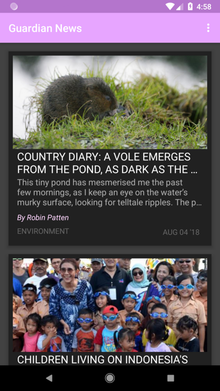
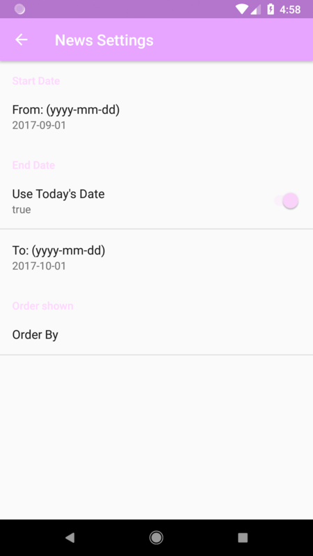
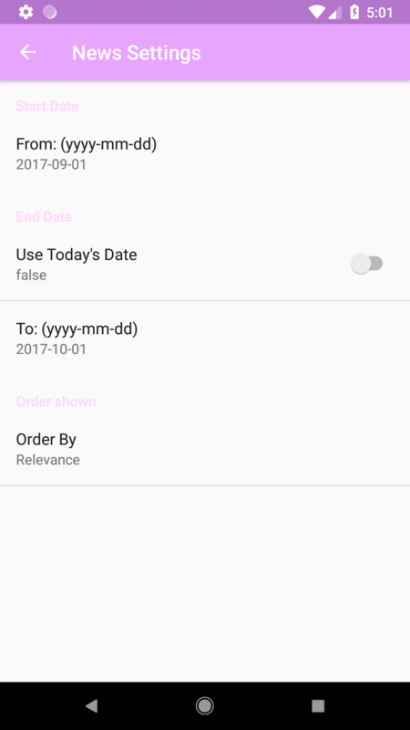
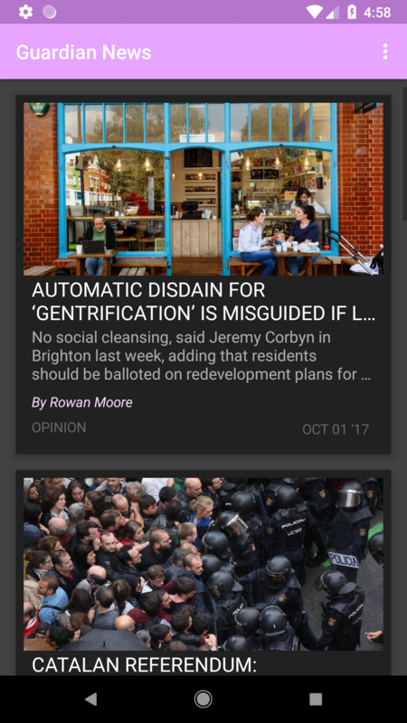
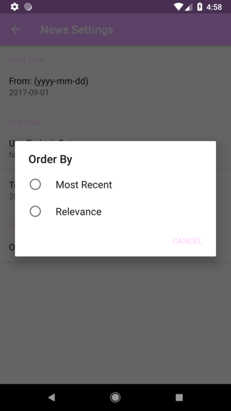

# Guardian News

**Created for the *Grow with Google Challenge Scholarship:* Android Basics Course**

Used **API 27: Android 8.1 (Oreo)**

This is the 6th project from my Udacity Android Basics Nanodegree program which is a news app that queries the Guardian API. 
I used a combination of AsyncTask and Loaders to retrieve and parse the JSON responses from the API queries. 

## Screenshots From the App:
    

## Features additional items not in the course
1. I created my own method hasConnection() for checking for internet connection located in ArticleActivty.java
as well as loadJSON() directly underneath it which functions as a helper method for my refresh setting.
2. For retreiving the images from the Guardian API I referenced Mohammad Ali Fouani's example at: https://stackoverflow.com/q/51587354/9302422 to get Bitmaps for the images. The corresponding java is located in the Article & ArticleAdapter java files as well as the list_item.xml file. 
